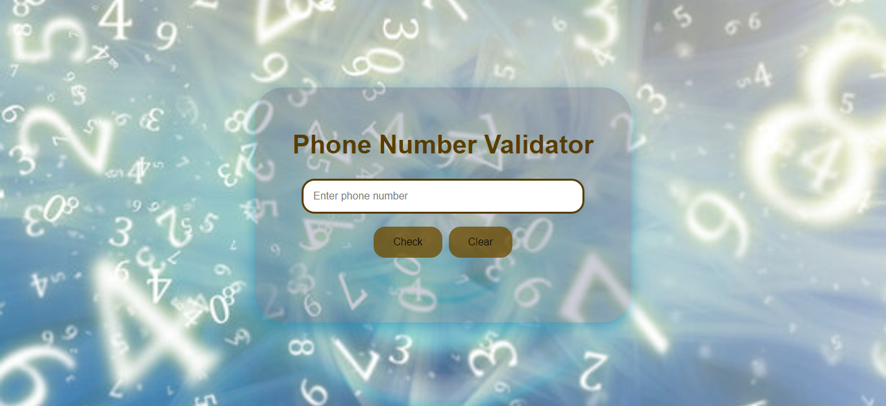

# Telephone-Number-Validator 🚀

## Project Description 📝

The Telephone Number Validator is a web-based application designed to validate telephone numbers using HTML, CSS, and JavaScript.
This application ensures users enter valid telephone numbers in the correct format. It features a responsive design, making it accessible and functional across various devices, from desktops to mobile phones.

## Demo 📸




## Technologies Used 🛠️


- HTML
- CSS
- JavaScript

## Installation 💻


Folow these steps to set up the project on your local machine 
Ensure you have the following software installed on your machine

```bash
#git clone
```
```bash
#git@github.com:Saqibi4213/Telephone-Number-Validator.git
```

## Usage 🎯


you can access to my project through git clone 
-git clone the HTTP or My SSH code link from the repository you what to clone 

```bash
#git clone
```

## Features ⭐

- User-Friendly Interface: Clean and modern design with a simple input field for entering telephone numbers.Clear and concise error messages to guide users when incorrect formats are entered.<br>
- Real-Time Validation: Uses JavaScript to validate the telephone number as the user types.Provides immediate feedback to the user, indicating whether the entered number is valid or not.<br>
- Responsive Design: Fully responsive layout using CSS media queries.Ensures optimal user experience on all screen sizes, from large desktop monitors to small mobile screens.<br>
Visual Feedback: Color-coded input field borders to indicate valid (green) or invalid (red) telephone numbers.Subtle animations to enhance user interaction and experience.

## Author 👩‍💻
- Website: [website.com]( https://saqibi4213.github.io/Telephone-Number-Validator/)
- LinkedIn: [Mehria saqibi](https://www.linkedin.com/in/mehria-saqibi-a386a41a1?utm_source=share&utm_campaign=share_via&utm_content=profile&utm_medium=android_app)
- Email: [email](mosawermh@gmail.com)

## Contributing 🤝

Contributions are welcome! If you'd like to contribute, please fork the repository and create a pull request. Ensure that your code follows the project's coding standards and guidelines.


